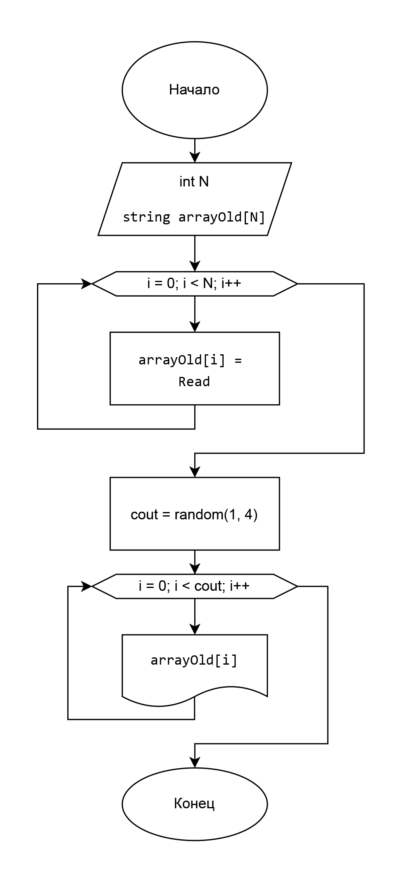

1.Создать массив (Создать строку и массив)

2.Заполнить массив (Заполнить строку с пробелами, перенести в массив без них)

3.Задать длину конечного массива при помощи генератора случайных чисел

4.Вывести новый массив

Блок-схема (код стал сложнее схемы)

