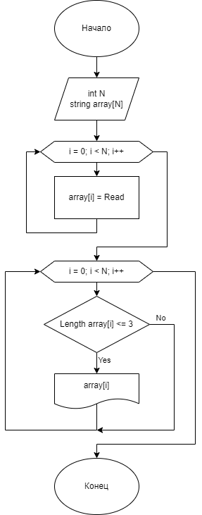

1.Создать массив (Создать строку и массив)

2.Заполнить массив (Заполнить строку с пробелами, перенести в массив без них)

3.Если строка в массиве короче 3 символов, сохранить в новый массив (Проверить все элементы массива)

4.Вывести новый массив

Блок-схема

